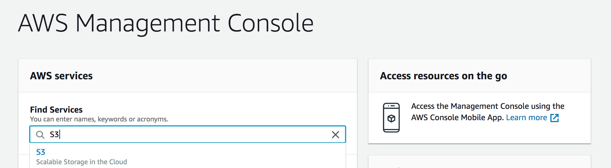
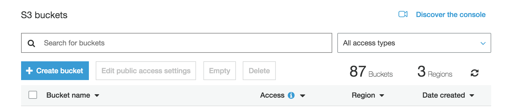
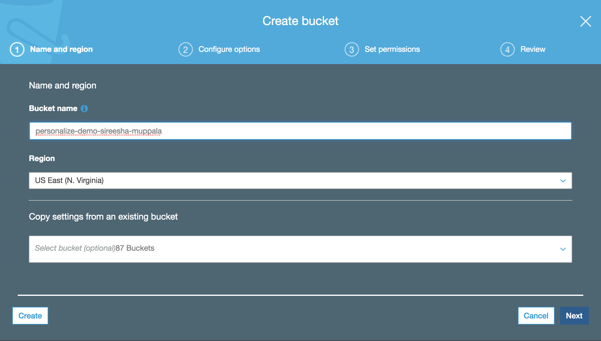
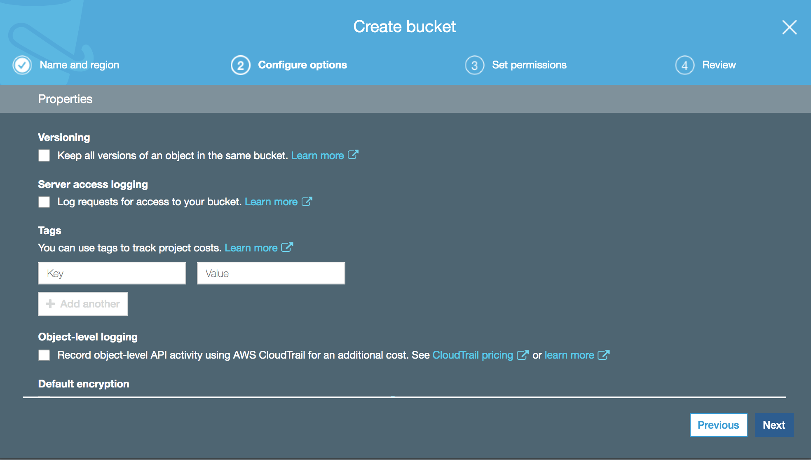
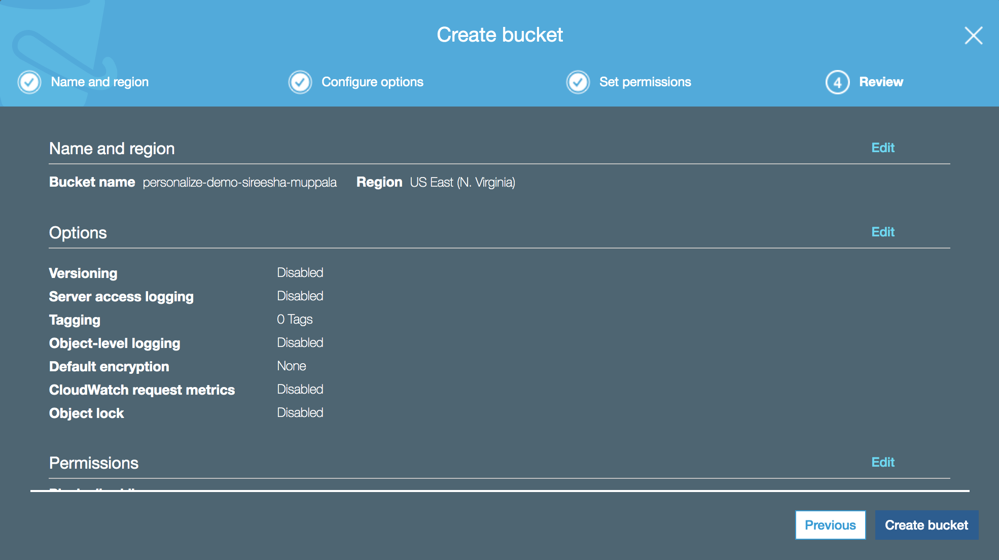
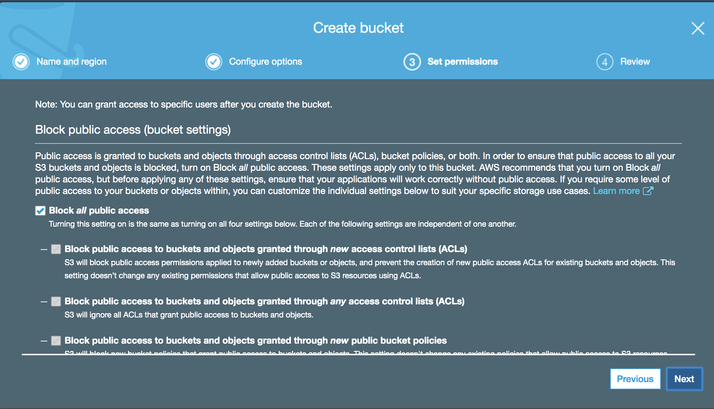
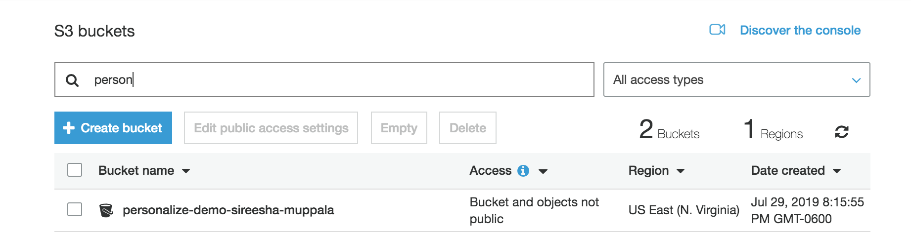

# Amazon Personalize Workshop

In this workshop you will build your very own recommendation model that will recommend movies to users based on their past preferences. You will further improve the recommendation model to take into account user's interactions with movie items to provide accurate recommendations.


## Prerequisites

1. AWS Account
2. User with administrator access to the AWS Account

## Setup

This section will walk through the following setup steps.

1. Create an S3 bucket that will be used to save movie lens data.
2. Create IAM role and IAM policy that provides Amazon SageMaker Notebook access to Amazon Personalize.
3. Create an Amazon SageMaker Notebook Instance.

In the next section the Amazon SageMaker Notebook will be used to explore the Amazon Personalize service.

### Step 1 : Create an S3 bucket

a. Login to the AWS console and search for S3 service.



b. In the S3 console, click "Create Bucket"



c. In the "NameRegion" screen

  Enter unique name for the bucket (For eg., personalize-demo-first-name)

  Select the region.



d. In the "Configure Options" screen leave defaults and click 'Next'



e. In the "Set Permissions" screen leave defaults and click 'Next'



f. In the "Review" screen click 'Next'



g. Verify that the S3 bucket is created.



### Step 2 : Create IAM role and IAM policy

### Step 3 : Create an Amazon SageMaker Notebook Instance


## Getting Started with Amazon Personalize with Amazon SageMaker.

This guide will walk through the creation of a new SageMaker Notebook Instance, the configuration of IAM policies, an S3 bucket
and your first project with Amazon Personalize. The Notebook Instance can then be used again for additional exploratory work with 
Amazon Personalize.


## Creating Your Notebook Instance

First you will need to create a new Notebook Instance, to do that begin by logging into the AWS Console.

Next, ensure you are in the US-East-1 Region, do do that look in the top left corner, if it says `N. Virginia` next to support
that is correct, otherwise select `N. Virginia` from the drop-down.

Under `Find services` in the main body of the page, enter `SageMaker`, then select it from the drop-down.

To the left, will see a category titled `Notebook` inside that, click `Notebook instances`.

Click the orange `Create notebook instance` button.

Give the instance a name unique in the account you are using. If a shared account, place your name first like `FirstNameLastNamePersonalizeDemo`. The default Instance
type is fine. 

The Next component to change is the IAM role. Under the drop-down click `Create a new role`. Then for S3, select `Any S3 Bucket`, finally click `Create role`. 
Note that the role itself has become a link, copy and paste this link to a blank text file first. Open that link in a new tab. 

Here you will update the policies of your instance to allow it to work with Personalize. Click the `Attach policies` button.

Next click the `Create policy` button at the top. In the new page, click the `JSON` tab.

Erase all of the content that is in the editor and paste the content in [IAM_Policy.json](IAM_Policy.json).

After pasting, click the `Review policy` button. Give the policy again a custom name like `FirstNameLastNamePersonalizeIAMPolicy`.

For the description, enter in something about it being used to demo Personalize. Finally click `Create policy`. Close this tab or window.

Once that has completed, click the `Roles` link on the left, then search for what you pasted in a text file earlier(just the end bits like `AmazonSageMaker-ExecutionRole-20190720T152376`), then click it.

Click Attach Policy button

Once closed you should see the tab for adding permissions to your SageMaker role. Click the `Filter Policies` link, then select
`Customer managed`. After that, you should see the policy you just created, if the list is long, just paste the name in the search bar to reduce the number of items. If you do not see it still, click the refresh icon in the top right of the page. To attach the policy you created click `Attach policies` again 

After clicking the checkbox next to the policy, click `Attach policy` at the bottom of the page. Then close this window.

Back at the SageMaker Notebook Instance creation page, now click `Create notebook instance` at the bottom of the page. This process will take 5-10 minutes to complete. Once the status says `InService` you are ready to continue to the 
next session.

## Agenda

1. `Personalize_BuildCampaign.ipynb`  - Guides you through building your first campaign and recommendation algorithm. 
2. `View_Campaign_And_Interactions.ipynb` - Showcase how to generate a recommendation and how to modify it with real time intent. 
3. `Cleanup.ipynb` - Deletes anything that was created so you are not charged for additional resources.


## Getting Started with Amazon Personalize.

To begin, click `Open Jupyter`, this will take you to the default interface for the Notebook Instance.

Click `New` then click `Terminal`, this will open a BASH shell for you on this instance. 

Enter the following commands to clone this repository onto this instance:

```
cd SageMaker
git clone https://github.com/chrisking/personalizedemo.git
```

After that close your Terminal tab and go back to the main Notebook interface.

A new folder titled `personalizedemo` should be visible, click it, click notebooks, then click `Personalize_BuildCampaign.ipynb` this will open the notebook.

If prompted for a kernel, select `conda_python3`.

From here you will follow the instructions outlined in the notebook. 

**Read Every Cell FULLY Before Executing It**


The rest of the lab will take place via the Jupyter notebooks. 

